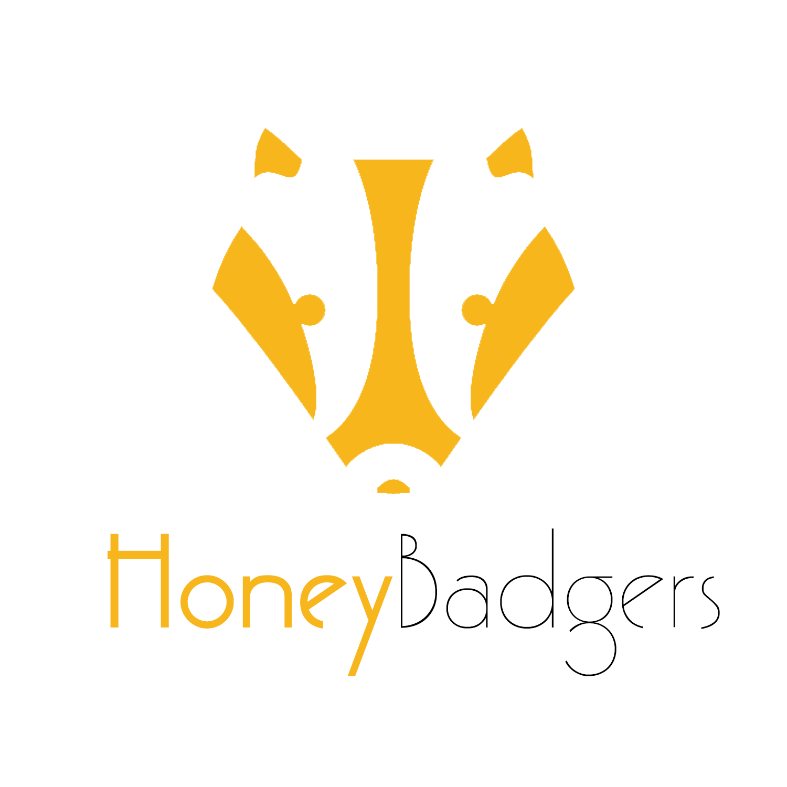

# HoneyBadgers :honey_pot:
#### BOUN-CmpE 352/451 Project

## :rocket: Freelancer | Collaboration Platform

This project provides an environment for clients and freelancers to collaborate in a single platform. The platform works as follows:

* Clients post project draft which requires proficiency on programming, writing, design, or development to find a fitting freelancer.
* Freelancers are free to bid on these projects until a certain deadline determined by the client. After collecting these bids, the client may agree with one of these freelancers.
* Agreements include information such as job completion deadline, total fee to be paid, and payment options.

For further information, please see our [Wiki](https://github.com/bounswe/bounswe2018group10/wiki) page.

## :honeybee: Team Members

 |  |  |  |  |  |   |  |  |  | 
---|---|---|---|---|---|---|---|---|---|---
[Halil Çetiner](https://github.com/bounswe/bounswe2018group10/wiki/Halil-%C3%87etiner) | [Barış Can Esmer](https://github.com/bounswe/bounswe2018group10/wiki/Bar%C4%B1%C5%9F-Can-Esmer) | [Ahmet Faruk Çelimli](https://github.com/bounswe/bounswe2018group10/wiki/Ahmet-Faruk-%C3%87elimli) | [Baran Kılıç](https://github.com/bounswe/bounswe2018group10/wiki/Baran-K%C4%B1l%C4%B1%C3%A7) | [Semih Basrık](https://github.com/bounswe/bounswe2018group10/wiki/Semih-Basrik) | [Canberk Yıldırım](https://github.com/bounswe/bounswe2018group10/wiki/Canberk-Y%C4%B1ld%C4%B1r%C4%B1m) | [Kaan Özgen](https://github.com/bounswe/bounswe2018group10/wiki/Kaan-Ozgen) | [Elifnaz Utkan](https://github.com/bounswe/bounswe2018group10/wiki/Elifnaz-Utkan) | [Abdüssamet Koçak](https://github.com/bounswe/bounswe2018group10/wiki/Abd%C3%BCssamet-Ko%C3%A7ak) | [Yaşar Alim Türkmen](https://github.com/bounswe/bounswe2018group10/wiki/Ya%C5%9Far-Alim-T%C3%BCrkmen) | [Muhammed Emin Vergili](https://github.com/bounswe/bounswe2018group10/wiki/Muhammed-Emin-Vergili)
