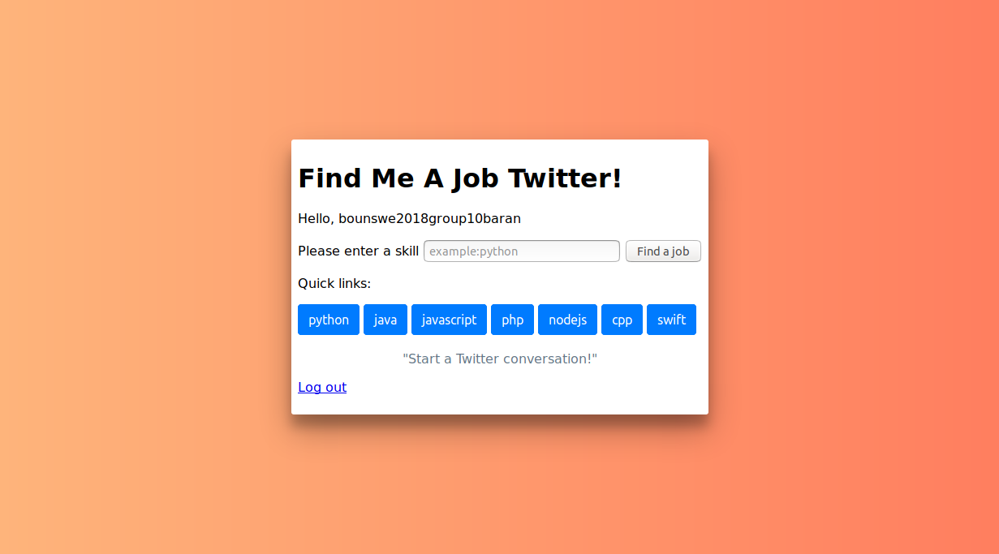

# Find Me A Job Twitter! - A Twitter App

This web app shows you job posting tweets about a particular skill.

# API
Note: App requires login via GUI. Therefore, this API will work only on browser. It can be tested by changing the url.
### GET /api/search/\<skill>
Returns tweets about job postings
#### Example request
`/api/search/python`
#### Example response
```
{
  "tweets": [ 
    {
      "author": {
        "name": "Stack Overflow Jobs", 
        "profile_image_url": "http://pbs.twimg.com/profile_images/643779014268579840/bRJStj7A_normal.png", 
        "screen_name": "StackDevJobs"
      }, 
      "created_at": "Mon, 30 Apr 2018 19:41:43 GMT", 
      "id_str": "991039916225237003", 
      "text": "Backend developer at Royce (Aventura, FL) https://t.co/n2tlP0kSB8 #python"
    }, 
    {
      "author": {
        "name": "Juri Fab", 
        "profile_image_url": "http://pbs.twimg.com/profile_images/736451697762013185/j6bJDESY_normal.jpg", 
        "screen_name": "couponcodes24"
      }, 
      "created_at": "Mon, 30 Apr 2018 19:41:41 GMT", 
      "id_str": "991039910302896133", 
      "text": "RT @byLilyV: #New #Udemy #Course:\n\n#Python and #Django #FullStack #WebDeveloper\nFull Stack Web Developer Bootcamp\nLearn to build websites w\u2026"
    }
  ]
}
```

# Usage
- Clone the repository
- Install the requirements using `pip install -r requirements.txt`
- Create a file named `.secrets.yaml` and paste in the Twitter _Consumer Key_ and _Consumer Secret_ keys as follows:
    ```yaml
    consumer_key: XXXXXXXXXXXXXXXXXXXXXXXXX
    consumer_secret: XXXXXXXXXXXXXXXXXXXXXXXXXXXXXXXXXXXXXXXXXXXXXXXXXX
    ```
- Run application.py

# Screenshots




